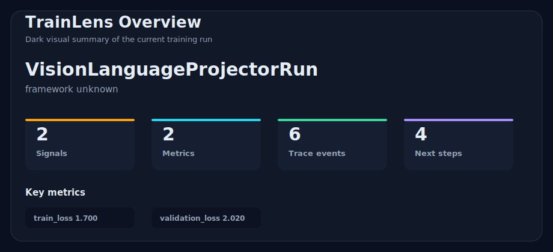
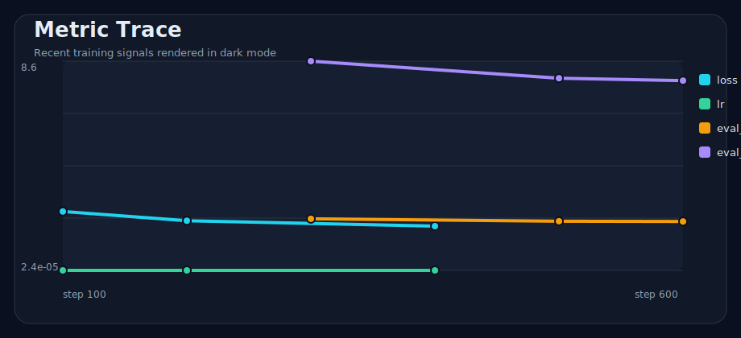
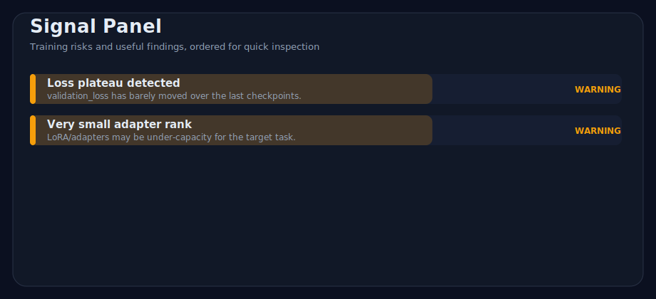
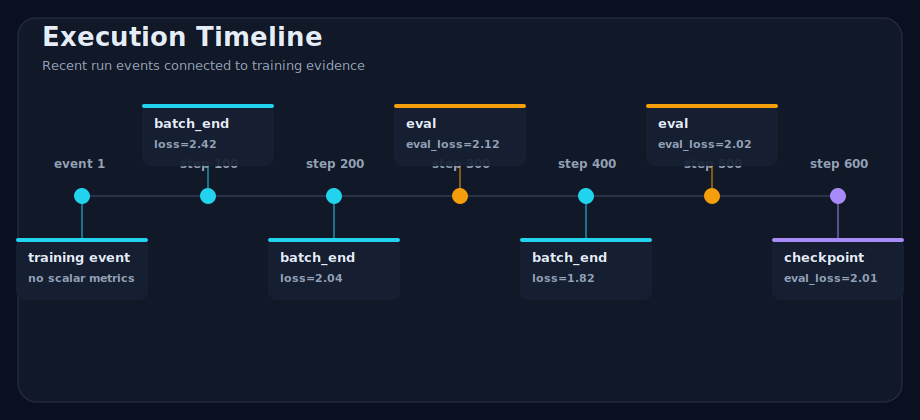
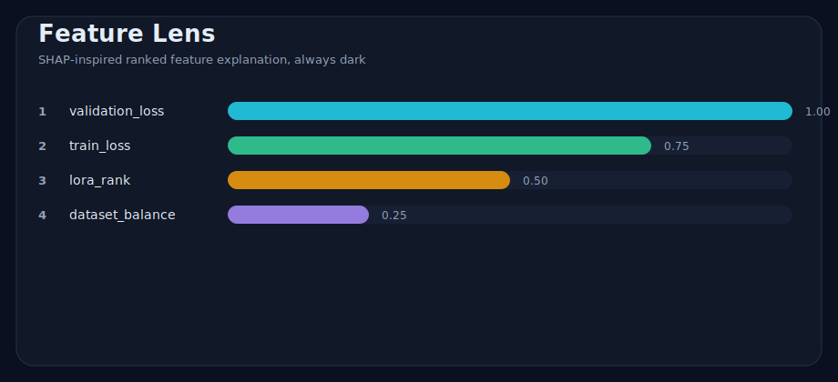

# TrainLens

TrainLens is an open-source framework for understanding machine learning training sessions directly inside Jupyter notebooks.

[](https://github.com/edujbarrios/trainlens/actions/workflows/ci.yml)
[](LICENSE)
[](pyproject.toml)

TrainLens inspects the state of a Jupyter notebook and turns training evidence into a readable report. It looks at model objects, metric histories, execution traces, dataset hints, and notebook variables, then explains what is happening and what to try next.

The project is focused on foundation-model training and fine-tuning runs: LLMs, CLIP-style contrastive models, ViTs, multimodal projectors, VLMs, and emerging audio/music generation systems.

## What TrainLens Does

TrainLens gives you a notebook-local training report:

1. It scans the notebook namespace for models, histories, metrics, traces, and useful metadata.
2. It normalizes common training artifacts such as Keras histories, Hugging Face `log_history`, and PyTorch loop metrics.
3. It applies heuristics for loss behavior, validation gaps, class balance, adapters, projectors, contrastive training, and multimodal runs.
4. It renders a Markdown report in the notebook.
5. Optionally, it sends that report to an OpenAI-compatible chat-completions endpoint for LLM-enhanced explanation.

No API key is required for the local analysis. API access is only needed for optional LLM enhancement.

## Visual Explanations

TrainLens is growing its own visual language for training runs: fast visual summaries that help you see which metrics, events, and model signals are driving the diagnosis. The visual renderer is dark-mode only, so generated assets are consistent in notebooks, docs, and reports.











```text
Model detected: LlavaForConditionalGeneration

Training summary:
- Foundation-model profile: LLM, PROJECTOR, VLM
- Validation loss plateaued across recent checkpoints
- Tiny trainable parameter ratio detected

Potential issues:
- Projector alignment may be under-capacity
- Retrieval/caption validation is missing

Recommended next steps:
- Track eval_loss, perplexity, learning-rate schedule, and gradient norm
- Validate projector alignment with frozen vision and language towers
- Evaluate text-image retrieval or held-out multimodal instructions
```

## Why TrainLens?

Most notebook explainability tools require a dedicated explainability package or a lot of manual wiring. TrainLens starts with what your notebook already has:

- Python variables in the active IPython shell
- trained model objects from Transformers, PEFT, PyTorch, timm, diffusers, audio stacks, and notebook code
- metric dictionaries and trainer histories from LLM/VLM fine-tuning loops
- execution traces such as `training_trace`, `execution_trace`, `log_history`, or `trainer.state.log_history`
- loss, perplexity, recall@k, contrastive loss, projector loss, audio reconstruction loss, and eval metrics
- LoRA/adapters, trainable parameter ratios, multimodal tower/projector hints, and audio-conditioning clues

It then turns that evidence into useful summaries, debugging signals, recommendations, and experiment ideas.

## How It Works

TrainLens is intentionally simple:

```text
Notebook variables
  -> namespace snapshot
  -> model and framework detection
  -> metric and execution-trace extraction
  -> training heuristics
  -> Markdown report
  -> optional LLM enhancement
```

You can use it in two ways:

- From inside a notebook with `explain_namespace(globals())` or the IPython magic commands.
- From the command line by passing an existing Markdown report to `tools/trainlens_openai_compatible.py`.

## Use Without Installing

```bash
git clone https://github.com/edujbarrios/trainlens.git
cd trainlens
python tools/trainlens_openai_compatible.py --help
```

TrainLens is designed so the notebook-side explainer can run locally without requiring users to install an extra Python library. The standalone OpenAI-compatible API tool uses only the Python standard library and reads configuration from environment variables.

```env
TRAINLENS_LLM_BASE_URL=https://api.example.com/v1
TRAINLENS_LLM_API_KEY=your_api_key_here
TRAINLENS_LLM_MODEL=auto
```

```bash
python tools/trainlens_openai_compatible.py training_report.md
```

From a notebook cell, without installing TrainLens as a library:

```python
!python tools/trainlens_openai_compatible.py training_report.md
```

## Jupyter Cell Examples

Use TrainLens directly from a cloned repo by adding `src/` to the notebook path.
This does not install a package into the environment.

```python
from pathlib import Path
import sys

TRAINLENS_REPO = Path("/path/to/trainlens").resolve()
sys.path.insert(0, str(TRAINLENS_REPO / "src"))
```

### Live notebook workflow

Cell 1: keep your normal training variables in the notebook.

```python
model = my_model
train_losses = [2.3, 1.9, 1.55, 1.34]
val_losses = [2.4, 2.0, 1.78, 1.72]
epoch_logs = [
    {"epoch": 1, "train_loss": 2.3, "val_loss": 2.4},
    {"epoch": 2, "train_loss": 1.9, "val_loss": 2.0},
    {"epoch": 3, "train_loss": 1.55, "val_loss": 1.78},
    {"epoch": 4, "train_loss": 1.34, "val_loss": 1.72},
]
```

Cell 2: render the live report and the dark visual dashboard.

```python
from trainlens.notebook import display_live_report

live_report = display_live_report(globals())
```

`live_report.result` keeps the structured analysis object, while
`live_report.markdown` and `live_report.dashboard_html` keep the rendered
artifacts.

Cell 3: use notebook magics after loading the extension.

```python
%load_ext trainlens.magic.extension
%explain_training
%training_dashboard
%compare_runs
```

See [docs/live-notebook-cells.md](docs/live-notebook-cells.md) for the same flow in a compact copy-paste format.

### Analyze an LLM fine-tune

```python
from trainlens.pipeline import explain_namespace
from trainlens.renderers.markdown import MarkdownRenderer
from IPython.display import Markdown, display


class MistralLoRAFineTune:
    class Config:
        model_type = "mistral"

    config = Config()


model = MistralLoRAFineTune()
history = {
    "train_loss": [2.6, 2.1, 1.92, 1.91],
    "eval_loss": [2.5, 2.18, 2.16, 2.16],
    "eval_perplexity": [12.2, 9.1, 8.9, 8.9],
}
lora_rank = 4
trainable_params = 8_000_000
total_params = 7_000_000_000

report = MarkdownRenderer().render(explain_namespace(globals()))
display(Markdown(report))
```

### Include execution traces

TrainLens can include recent training events in the report. Use a list of dictionaries named `training_trace`, `execution_trace`, `trace`, `logs`, or `log_history`. Hugging Face-style `trainer.state.log_history` is also detected.

```python
training_trace = [
    {"step": 100, "epoch": 0.5, "event": "batch_end", "loss": 1.92, "lr": 2e-5},
    {"step": 200, "epoch": 1.0, "event": "eval", "eval_loss": 1.76, "eval_perplexity": 5.8},
    {"step": 300, "epoch": 1.5, "event": "checkpoint", "message": "saved adapter weights"},
]

report = MarkdownRenderer().render(explain_namespace(globals()))
display(Markdown(report))
```

The report will show an `Execution trace` table with step, epoch, event, and numeric metrics. This makes it easier to connect the final diagnosis with what actually happened during the run.

### Analyze PyTorch loop metrics

TrainLens detects common PyTorch training-loop variables such as `train_losses`, `val_losses`, `epoch_logs`, `callback_metrics`, and `logged_metrics`. Tensor-like scalar values are supported when they expose `.item()`, which covers the common `torch.Tensor` case.

```python
train_losses = [2.3, 1.9, 1.55, 1.34]
val_losses = [2.4, 2.0, 1.78, 1.72]
epoch_logs = [
    {"epoch": 1, "train_loss": 2.3, "val_loss": 2.4},
    {"epoch": 2, "train_loss": 1.9, "val_loss": 2.0},
]

display(Markdown(MarkdownRenderer().render(explain_namespace(globals()))))
```

For a runnable no-PyTorch dependency example:

```bash
python examples/pytorch_loop_metrics.py
```

### Generate dark visual explanations

Use `DarkVisualRenderer` when you want notebook-friendly SVG images alongside the Markdown report.

```python
from trainlens.pipeline import explain_namespace
from trainlens.renderers.visual import DarkVisualRenderer


result = explain_namespace(globals())
assets = DarkVisualRenderer().write_dashboard_assets(result, "trainlens_assets")

assets["metric_trace"]
assets["signal_panel"]
assets["feature_lens"]
```

For an inline notebook dashboard:

```python
from IPython.display import HTML, display

display(HTML(DarkVisualRenderer().render_dashboard_html(result)))
```

The same flow is available as a runnable example:

```bash
python examples/visual_explanations.py
python examples/live_dashboard_export.py
```

### Analyze a VLM projector run

```python
class LlavaProjectorRun:
    vision_tower = object()
    language_model = object()
    mm_projector = object()

    class Config:
        model_type = "llava"

    config = Config()


model = LlavaProjectorRun()
history = {
    "train_loss": [2.4, 1.9, 1.72, 1.71],
    "eval_loss": [2.3, 2.0, 1.99, 1.99],
}
lora_rank = 4

display(Markdown(MarkdownRenderer().render(explain_namespace(globals()))))
```

### Analyze an AI music generation run

TrainLens can also summarize the evidence around music-generation experiments, including
text-to-music, audio-to-audio, MIDI/symbolic generation, stem-aware models, vocal models,
and multimodal audio-language alignment runs.

```python
class MusicDiffusionFineTune:
    text_encoder = object()
    audio_autoencoder = object()
    diffusion_unet = object()

    class Config:
        model_type = "musicgen"

    config = Config()


model = MusicDiffusionFineTune()
history = {
    "train_loss": [1.82, 1.41, 1.22, 1.18],
    "eval_loss": [1.75, 1.48, 1.42, 1.43],
    "spectral_convergence": [0.38, 0.31, 0.29, 0.28],
    "clap_score": [0.21, 0.27, 0.30, 0.31],
}
sample_rate = 44_100
conditioning = ["text_prompt", "tempo", "key", "genre"]

display(Markdown(MarkdownRenderer().render(explain_namespace(globals()))))
```

For music-generation notebooks, useful evidence to expose in the namespace includes:

- objective metrics: reconstruction loss, diffusion loss, STFT loss, mel loss, spectral convergence, FAD, CLAP score, beat alignment, pitch accuracy, and prompt-audio retrieval
- conditioning metadata: text prompts, tempo, key, genre, style tags, lyrics, chord charts, MIDI controls, seed audio, stems, and duration buckets
- architecture hints: audio autoencoders, diffusion/flow/transformer decoders, EnCodec-style tokenizers, CLAP/audio-language encoders, vocoders, LoRA adapters, and control modules
- dataset signals: clip length distribution, sample rate, loudness normalization, silence ratio, duplicate tracks, train/validation artist leakage, license labels, and vocal/instrumental splits
- generation risks: memorization of copyrighted material, prompt leakage, singer or artist imitation, lyric toxicity, degraded stereo image, clipping, mode collapse, and weak long-range structure

### Create and enhance a Markdown report from Jupyter

You can generate the TrainLens report, save it as Markdown, preview it in the
notebook, and then send that same file to an OpenAI-compatible endpoint. This is
the most direct workflow when you want a reproducible report artifact from one
cell.

```python
from pathlib import Path

from IPython.display import Markdown, display
from trainlens.pipeline import explain_namespace
from trainlens.renderers.markdown import MarkdownRenderer


report_path = Path("training_report.md")
report = MarkdownRenderer().render(explain_namespace(globals()))
report_path.write_text(report, encoding="utf-8")

display(Markdown(report))
print(f"Wrote {report_path.resolve()}")
```

Then run the optional LLM enhancement against the Markdown file:

```python
!python /path/to/trainlens/tools/trainlens_openai_compatible.py training_report.md
```

If you prefer to keep the whole workflow in Python instead of using notebook
shell syntax, call the helper with `subprocess`:

```python
import os
import subprocess
import sys

env = {
    **os.environ,
    "TRAINLENS_LLM_BASE_URL": "https://api.example.com/v1",
    "TRAINLENS_LLM_API_KEY": "your_api_key_here",
    "TRAINLENS_LLM_MODEL": "auto",
}

completed = subprocess.run(
    [
        sys.executable,
        "/path/to/trainlens/tools/trainlens_openai_compatible.py",
        str(report_path),
    ],
    check=True,
    capture_output=True,
    env=env,
    text=True,
)

enhanced_report = completed.stdout
display(Markdown(enhanced_report))
```

More examples live in [`notebooks/`](notebooks/).

Contributor setup for package internals lives in [CONTRIBUTING.md](CONTRIBUTING.md).

## Optional LLM Enhancement

TrainLens never requires API access. LLM support is opt-in and provider based.

```env
TRAINLENS_LLM_BASE_URL=https://api.example.com/v1
TRAINLENS_LLM_API_KEY=your_api_key_here
TRAINLENS_LLM_MODEL=auto
```

The current provider targets OpenAI-compatible chat completions. The provider interface is intentionally small so hosted APIs, Ollama-compatible gateways, and local model servers can be swapped without changing analyzer logic.

LLM enhancement prompts are rendered from a parameterized Jinja2 template, so audience, tone, model-family focus, safety rules, and report content can evolve without hardcoding provider-specific strings.

## Architecture

```text
Notebook Hook Layer
  -> Notebook Introspection Engine
  -> Training Session Analyzer
  -> Execution Trace Extractor
  -> Metric Interpretation Engine
  -> Explanation Generator
  -> Notebook Renderer
```

Core modules live under `src/trainlens`:

- `introspection`: notebook namespace scanning and model discovery
- `analyzers`: framework and training-session analyzers
- `heuristics`: loss, convergence, contrastive, adapter, projector, and multimodal rules
- `models`: typed domain objects
- `llm`: provider abstractions and optional enhancement
- `magic`: IPython magic commands
- `renderers`: notebook Markdown/Rich output and dark-mode SVG visual explanations
- `storage`: run persistence and comparison

## AI Music Generation Coverage

AI music generation spans more than one model family, so TrainLens treats it as a multimodal training problem rather than a single metric dashboard. The page and roadmap cover these sides:

- `text-to-music`: prompt adherence, style control, genre conditioning, duration handling, and audio-language retrieval metrics
- `audio-to-audio`: continuation, inpainting, variation, timbre transfer, denoising, source-conditioned generation, and reconstruction quality
- `symbolic music`: MIDI tokens, note density, pitch range, chord progression, tempo maps, quantization, and arrangement structure
- `vocals and lyrics`: lyric alignment, phoneme timing, singer identity risk, pronunciation, intelligibility, and separation between voice and instrumental quality
- `stems and production`: drum/bass/melody/stem conditioning, mix balance, stereo field, loudness, clipping, and mastering artifacts
- `evaluation`: FAD, CLAP score, spectral metrics, beat and pitch tracking, human preference tests, prompt-audio retrieval, and held-out style validation
- `responsible release`: dataset licenses, attribution, opt-out lists, duplicate detection, memorization probes, watermarking, and artist/style imitation policy

## Roadmap

- richer Hugging Face Trainer, Accelerate, PEFT, and DeepSpeed history extraction
- first-class CLIP, SigLIP, ViT, projector, and VLM validation reports
- first-class AI music generation diagnostics for audio tokenizers, diffusion models, CLAP alignment, MIDI/symbolic models, vocals, stems, and long-form structure
- notebook cell execution hooks
- plugin discovery through entry points
- local model adapters
- visual and audio diagnostics for fine-tuning drift, alignment regressions, waveform quality, spectrogram artifacts, and memorization probes
- public example notebooks and screenshots

## Screenshots

Dark-mode visual examples live in `docs/assets/` and are generated by [`examples/visual_explanations.py`](examples/visual_explanations.py). See [docs/visual-explanations.md](docs/visual-explanations.md) for the visual report shape.

## Contributing

TrainLens is open source from day one. Contributors are welcome across analyzers, notebook UX, docs, examples, and tests. See [CONTRIBUTING.md](CONTRIBUTING.md) and [docs/roadmap.md](docs/roadmap.md).

## License

Apache License 2.0. See [LICENSE](LICENSE).
